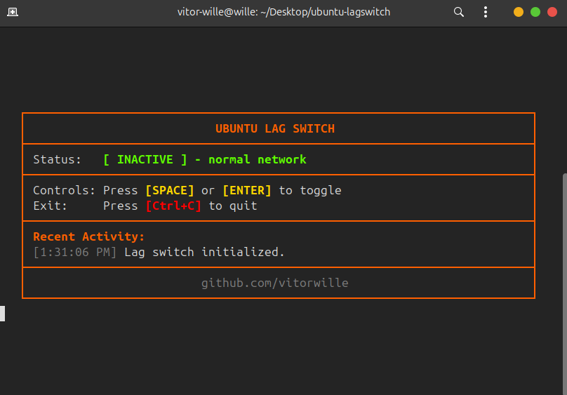

# Ubuntu Lag Switch

A simple software-based lag switch created using TypeScript and `iptables` for network testing purposes.

  

## How to Use

1. Run `npm install` (or `npm i`) in the project folder.
2. Run `sudo npm start`.
3. Toggle it pressing SPACE or ENTER. Press CTRL+C to exit.

---

## How It Works

The program creates a custom `iptables` chain named `LAG_SWITCH`:
1. It adds rules to bypass loopback traffic and active SSH connections.
2. It appends a `DROP` target rule to drop all other traffic.
3. When the lag switch is **activated**, it inserts references to the `LAG_SWITCH` chain at the top of the `INPUT` and `OUTPUT` chains.
4. When **deactivated**, it deletes those references, restoring normal network flow.

---

## Prerequisites

- **Linux-based system** with `iptables` installed.
- **Root Privileges** (needed to modify `iptables` rules).
- **Node.js**
